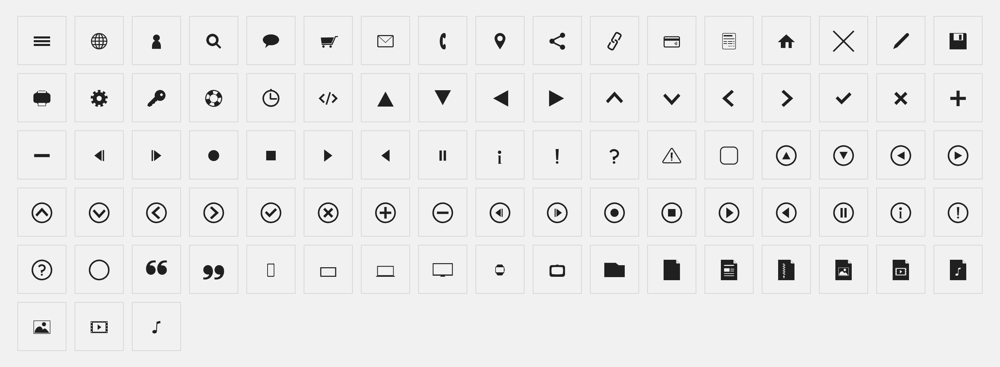

# iconset

Set of icons.

Source from: [export/iconset.svg](export/iconset.svg) and from root: [iconset.afdesigner](iconset.afdesigner) (Affinity Designer).

#### Demo here: [https://ctlcltd.github.io/iconset/demo.html](https://ctlcltd.github.io/iconset/demo.html)

To generate the font use [IcoMoon](https://icomoon.io/app), file: [iconset.json](iconset.json).

 

## Contributing

You can open [issues](https://github.com/ctlcltd/iconset/issues) to report bug, request features or send a [Pull Request](https://github.com/ctlcltd/iconset/pulls).

## License

[MIT License](LICENSE).

